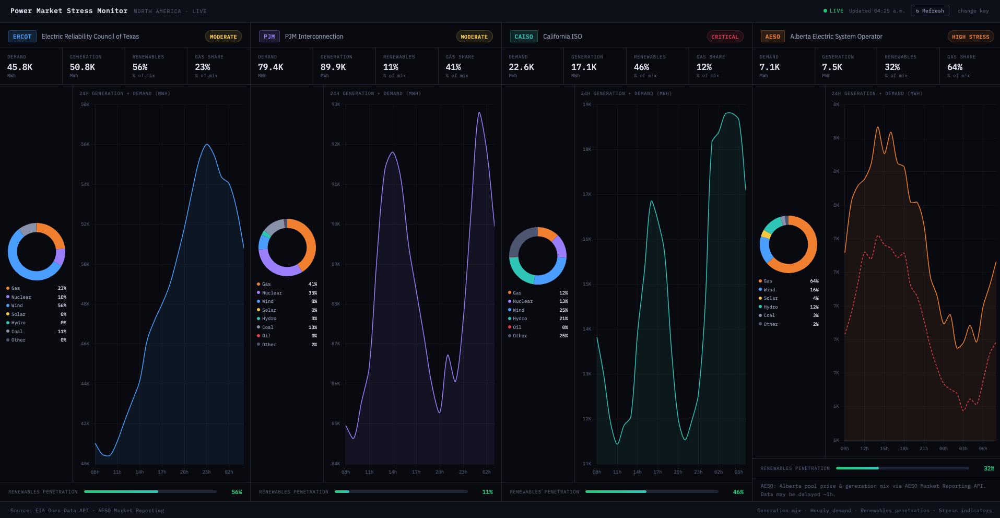

# Power Market Stress Monitor

**Live generation mix, demand, and grid stress indicators across North American electricity markets**

→ **[Open the live monitor](https://moezusb.github.io/power-market-monitor)**

---

## Overview

A real-time power market dashboard built from a physical trader's perspective — tracking the conditions that precede price spikes and grid stress events: tight reserve margins, high gas dependency, low renewable output, and demand surges.

Covers four North American markets side by side:

| Market | Region | Source |
|--------|--------|--------|
| **ERCOT** | Texas | EIA Open Data API |
| **PJM** | Mid-Atlantic / Midwest | EIA Open Data API |
| **CAISO** | California | EIA Open Data API |
| **AESO** | Alberta, Canada | AESO Market Reporting API |

---

## What it tracks

**Per market, updated hourly:**

- **Generation mix** — fuel-by-fuel donut showing real-time share of gas, nuclear, wind, solar, hydro, coal
- **24h generation vs demand trend** — area chart overlaying total generation against load, highlighting supply/demand gaps
- **Grid stress indicator** — NORMAL / MODERATE / HIGH / CRITICAL, derived from the demand-to-generation ratio
- **Renewables penetration** — wind + solar + hydro as % of total generation
- **Gas share** — proxy for fuel cost exposure and carbon intensity

**Why these metrics?**
Power prices are driven by the margin between supply and demand, and by the marginal fuel — typically natural gas. High gas share + tight reserve margin + low renewables is the classic setup for a price spike. This tool surfaces exactly that signal.

---

## Stack

Single self-contained `index.html` — no build step, no framework, no backend.

- [EIA Open Data API](https://www.eia.gov/opendata/) — free, requires a key (register in 30 seconds)
- [Chart.js 4.4](https://www.chartjs.org/) for generation mix donuts and 24h trend lines
- Vanilla JS for data fetching, processing, and state management
- API key stored in `localStorage` — never hardcoded, safe for public repos
- Auto-refreshes every 15 minutes
- Hosted on GitHub Pages

---

## Running locally

No install required. Just open `index.html` in any browser and enter your free EIA API key when prompted.

Get a key at [eia.gov/opendata/register.php](https://www.eia.gov/opendata/register.php) — no credit card, no phone number, delivered by email in under a minute.

---

*Part of a macro & energy markets side project series. See also: [Yield Curve Monitor](https://moezusb.github.io/yield-curve-monitor)*
